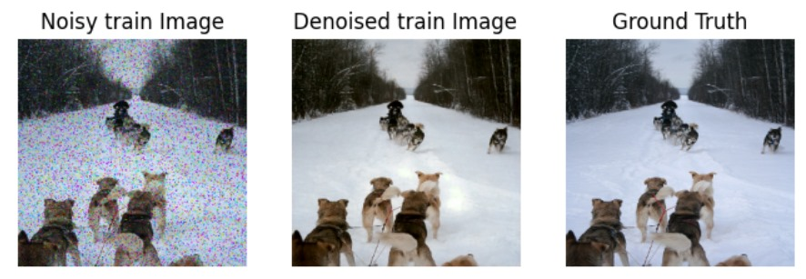
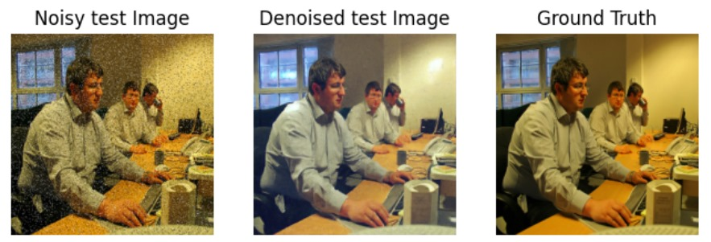

# GAN-Based Image Denoising

A deep learning project that uses a **Generative Adversarial Network (GAN)** to restore noisy images by learning the mapping between noisy and clean image pairs. The model was trained on synthetically corrupted images and evaluated using image quality metrics such as **PSNR** and **SSIM**.

> **Academic Project**  
> Final Year Project – Bachelor of Engineering in Electronics, Communication and Information Engineering

## Overview

Image denoising is a fundamental computer vision task that aims to recover clean images from degraded inputs. In this project, a Generative Adversarial Network (GAN) was implemented to learn the relationship between noisy and clean images, enabling the model to produce visually realistic denoised outputs.

The trained model was integrated into a web application with a **Next.js** frontend and **Django** backend, and deployed through **Hugging Face** for inference.

## Features

- GAN-based image denoising
- Image restoration from multiple noise types
- TensorFlow implementation
- Web interface using Next.js and Django
- Performance evaluated using PSNR and SSIM
- Deployed for public inference via Hugging Face

## What is a GAN?

Generative Adversarial Networks (GANs) consist of two neural networks trained simultaneously.

### Generator
The generator receives a noisy image and attempts to generate a clean version.

### Discriminator
The discriminator distinguishes generated images from real clean images and provides feedback to improve the generator.

Through adversarial learning, both networks improve over time, enabling the generator to produce increasingly realistic denoised images.

## Dataset

**Source:** Flickr Images Dataset (Kaggle)

### Noise Types

- Gaussian Noise
- Salt & Pepper Noise
- Speckle Noise

### Dataset Split

| Dataset | Percentage |
|---------|-----------:|
| Training | 70% |
| Validation | 20% |
| Testing | 10% |

## Preprocessing

- Added synthetic noise to clean images
- Resized all images to **256 × 256**
- Divided the dataset into training, validation, and testing sets

## Model Architecture

The model consists of two competing neural networks.

### Generator

- Learns to reconstruct clean images from noisy inputs.

### Discriminator

- Evaluates whether generated images resemble real clean images.

### Training Configuration

| Parameter | Value |
|-----------|-------|
| Optimizer | Adam |
| Epochs | 200 |
| Batch Size | 8 |

### Loss Functions

Generator Loss

- Adversarial Loss
- Pixel Loss
- Feature Loss
- Smooth Loss

Discriminator Loss

- Relativistic Average Hinge Loss

## Evaluation Metrics

The trained model was evaluated using:

- Peak Signal-to-Noise Ratio (PSNR)
- Structural Similarity Index (SSIM)

## Results

### Sample Outputs

| Noisy Image | Denoised Image |
|--------------|----------------|
|  |  |

Additional examples are available in the **assets/** directory.

## Deployment

- **Frontend:** Next.js
- **Backend:** Django
- **Model Hosting:** Hugging Face

**Live Demo**

https://denoisify.vercel.app/

> *The backend is currently not hosted, so live inference may not be available.*

## Tech Stack

- Python
- TensorFlow
- Next.js
- Django
- Hugging Face
- OpenCV
- NumPy

## Contributors

- Stuti Acharya
- Simran Dhakal
- Shraddha Bhattarai
- Arati Shrestha

## Acknowledgements

This project was completed as part of the undergraduate engineering curriculum at **Tribhuvan University, Institute of Engineering (IOE), Purwanchal Campus**.
